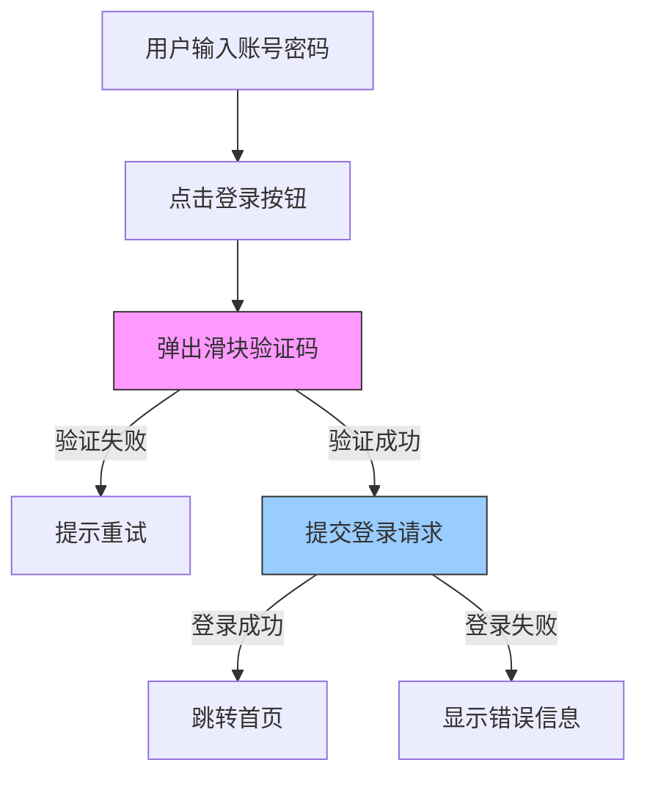
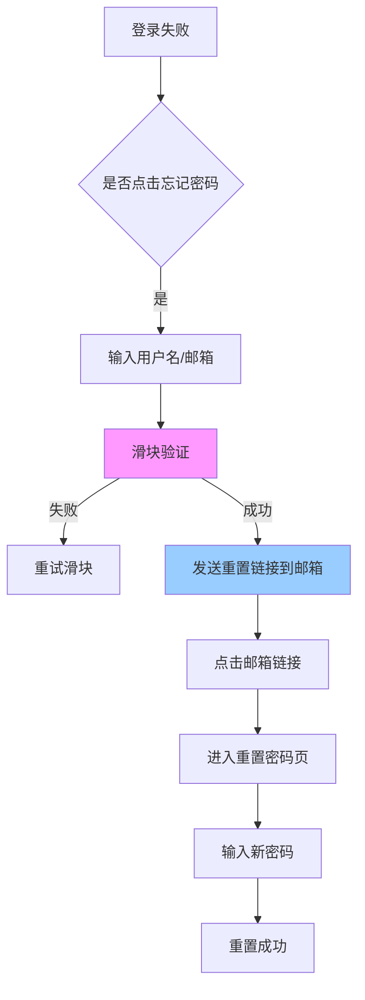
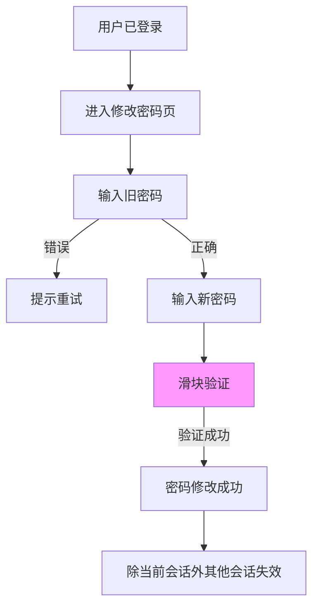
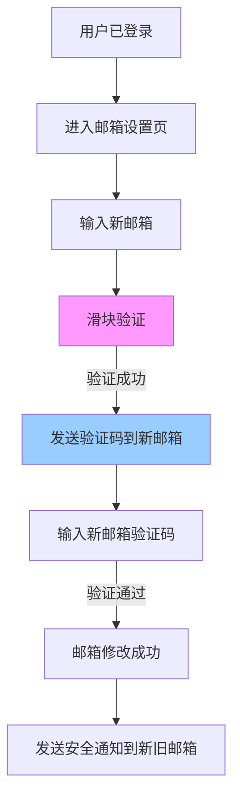

# Cloudflare 验证码集成 Spec

## Why

当前系统缺乏人机验证机制，面临以下安全风险：

* 自动化攻击：恶意脚本批量注册、登录尝试

* 暴力破解：密码重试攻击

* 垃圾内容：自动化评论、留言刷屏

* 账号安全：邮箱重绑、密码修改等敏感操作缺乏二次验证

集成Cloudflare验证码可以有效区分人类与机器，提升账号安全性，防止自动化攻击。

## What Changes

### 新增功能

* **Cloudflare验证码集成**：支持智能验证（低风险）和滑块验证（中高风险）

* **阶梯式验证策略**：根据场景风险等级自动选择验证强度

* **验证记录追踪**：记录验证行为用于安全审计

* **多语言支持**：验证码提示支持中英文切换

### 配置项新增

* `captcha.tencent.app_id` - Cloudflare验证码 AppID

* `captcha.tencent.app_secret` - Cloudflare验证码 AppSecret

* `captcha.enabled` - 验证码功能开关

### 受影响的场景

| 场景              | 风险等级     | 验证类型 | 验证时机   |
| --------------- | -------- | ---- | ------ |
| 登录              | ⚠️⚠️ 中   | 滑块验证 | 点击登录前  |
| 登录失败时修改密码（忘记密码） | ⚠️⚠️⚠️ 高 | 滑块验证 | 发送验证码前 |
| 登录成功后修改密码       | ⚠️⚠️ 中   | 滑块验证 | 提交修改前  |
| 登录成功后重绑邮箱       | ⚠️⚠️⚠️ 高 | 滑块验证 | 发送验证码前 |
| 注册              | ⚠️⚠️ 中   | 滑块验证 | 发送验证码前 |
| 评论              | ⚠️ 低     | 滑块验证 | 提交评论前  |
| 留言              | ⚠️ 低     | 滑块验证 | 提交留言前  |

## Impact

### Affected Code

**后端新增文件：**

* `oc-platform-common/src/main/java/com/ocplatform/common/service/CaptchaService.java` - 验证码服务

* `oc-platform-common/src/main/java/com/ocplatform/common/dto/CaptchaVerifyRequest.java` - 验证请求DTO

* `oc-platform-common/src/main/java/com/ocplatform/common/dto/CaptchaVerifyResponse.java` - 验证响应DTO

* `oc-platform-common/src/main/java/com/ocplatform/common/entity/CaptchaRecord.java` - 验证记录实体

* `oc-platform-common/src/main/java/com/ocplatform/common/mapper/CaptchaRecordMapper.java` - 验证记录Mapper

**后端修改文件：**

* `oc-platform-user/src/main/java/com/ocplatform/user/controller/AuthController.java` - 添加验证码校验

* `oc-platform-user/src/main/java/com/ocplatform/user/service/AuthService.java` - 集成验证码验证

* `oc-platform-user/src/main/java/com/ocplatform/user/controller/CommentController.java` - 评论验证码

* `oc-platform-common/src/main/java/com/ocplatform/common/controller/FeedbackController.java` - 留言验证码

* `oc-platform-app/src/main/resources/application.yml` - 添加Cloudflare验证码配置

**前端新增文件：**

* `oc-platform-web/src/components/TencentCaptcha/index.tsx` - Cloudflare验证码组件

* `oc-platform-web/src/hooks/useCaptcha.ts` - 验证码Hook

**前端修改文件：**

* `oc-platform-web/src/pages/Login/index.tsx` - 集成登录验证码

* `oc-platform-web/src/pages/Register/index.tsx` - 集成注册验证码

* `oc-platform-web/src/pages/ForgotPassword/index.tsx` - 集成忘记密码验证码

* `oc-platform-web/src/pages/Profile/index.tsx` - 集成修改密码/邮箱验证码

* `oc-platform-web/src/pages/ProductDetail/index.tsx` - 集成评论验证码

* `oc-platform-web/src/components/home/FeedbackSection.tsx` - 集成留言验证码

* `oc-platform-web/src/utils/api.ts` - 添加验证码API

* `oc-platform-web/src/locales/zh-CN.json` - 添加中文翻译

* `oc-platform-web/src/locales/en-US.json` - 添加英文翻译

**数据库新增：**

* `captcha_records` 表 - 验证码验证记录

**配置新增：**

* Docker 环境变量：`TENCENT_CAPTCHA_APP_ID`、`TENCENT_CAPTCHA_APP_SECRET`

## ADDED Requirements

### Requirement: Cloudflare验证码集成

系统应集成Cloudflare验证码服务，支持智能验证和滑块验证两种验证方式，防止自动化攻击。

#### Scenario: 登录验证码验证

* **WHEN** 用户点击登录按钮

* **THEN** 系统弹出滑块验证码

* **AND** 用户完成验证后才能提交登录请求

* **AND** 验证票据在5分钟内有效

#### Scenario: 注册验证码验证

* **WHEN** 用户点击发送验证码按钮

* **THEN** 系统弹出滑块验证码

* **AND** 用户完成验证后才能发送邮箱验证码

#### Scenario: 敏感操作验证

* **WHEN** 用户执行修改密码、修改邮箱等敏感操作

* **THEN** 系统要求滑块验证

* **AND** 验证通过后才能继续操作

#### Scenario: 评论留言验证

* **WHEN** 用户提交评论或留言

* **THEN** 系统弹出滑块验证码

* **AND** 验证通过后才能提交内容

### Requirement: 验证码配置管理

系统应支持通过管理后台配置验证码相关参数。

#### Scenario: 配置验证码开关

* **WHEN** 管理员在系统设置中切换验证码开关

* **THEN** 系统立即生效该配置

* **AND** 前端根据配置决定是否显示验证码

#### Scenario: 配置Cloudflare验证码密钥

* **WHEN** 管理员配置Cloudflare验证码 AppID 和 AppSecret

* **THEN** 系统加密存储密钥

* **AND** 验证码服务使用新密钥进行验证

### Requirement: 验证记录审计

系统应记录所有验证码验证行为，用于安全审计。

#### Scenario: 记录验证成功

* **WHEN** 用户通过验证码验证

* **THEN** 系统记录用户ID、IP地址、验证场景、验证时间

#### Scenario: 记录验证失败

* **WHEN** 用户验证码验证失败

* **THEN** 系统记录失败原因、IP地址、验证场景

### Requirement: 多语言支持

验证码组件应支持中英文切换。

#### Scenario: 中文环境验证码

* **WHEN** 用户语言设置为中文

* **THEN** 验证码提示文字显示中文

#### Scenario: 英文环境验证码

* **WHEN** 用户语言设置为英文

* **THEN** 验证码提示文字显示英文

## MODIFIED Requirements

### Requirement: 登录流程增强

登录流程需增加验证码验证步骤。

#### Scenario: 登录流程

* **WHEN** 用户输入账号密码并点击登录

* **THEN** 系统先弹出验证码

* **AND** 验证通过后才提交登录请求

* **AND** 验证失败则提示用户重试验证码

### Requirement: 注册流程增强

注册流程需在发送邮箱验证码前增加验证码验证。

#### Scenario: 注册发送验证码

* **WHEN** 用户点击发送验证码

* **THEN** 系统先弹出验证码

* **AND** 验证通过后才发送邮箱验证码

### Requirement: 密码重置流程增强

忘记密码流程需在发送重置邮件前增加验证码验证。

#### Scenario: 忘记密码发送验证码

* **WHEN** 用户输入邮箱并点击发送

* **THEN** 系统先弹出验证码

* **AND** 验证通过后才发送重置邮件

### Requirement: 评论留言流程增强

评论和留言提交前需验证码验证。

#### Scenario: 提交评论

* **WHEN** 用户填写评论内容并点击提交

* **THEN** 系统先弹出验证码

* **AND** 验证通过后才提交评论

## Design Details

### 1. 验证场景详细设计

#### 1.1 登录场景



#### 1.2 登录失败时修改密码（忘记密码）



#### 1.3 登录成功后修改密码



#### 1.4 登录成功后重新绑定邮箱



### 2. 技术架构

#### 2.1 前端组件设计

```typescript
// TencentCaptcha 组件接口
interface TencentCaptchaProps {
  appId: string;
  onVerify: (ticket: string, randstr: string) => void;
  onClose?: () => void;
  lang?: 'zh-CN' | 'en-US';
}

// useCaptcha Hook
interface UseCaptchaReturn {
  verify: () => Promise<{ ticket: string; randstr: string }>;
  loading: boolean;
  error: string | null;
}
```

#### 2.2 后端服务设计

```java
// CaptchaService 接口
public interface CaptchaService {
    // 验证票据
    CaptchaVerifyResponse verify(CaptchaVerifyRequest request);
    
    // 检查是否启用验证码
    boolean isEnabled();
    
    // 获取验证码配置
    CaptchaConfig getConfig();
}

// 验证请求
public class CaptchaVerifyRequest {
    private String ticket;      // 验证码票据
    private String randstr;     // 随机字符串
    private String scene;       // 验证场景
    private String clientIp;    // 客户端IP
}
```

#### 2.3 数据库设计

```sql
-- 验证码验证记录表
CREATE TABLE captcha_records (
    id BIGSERIAL PRIMARY KEY,
    user_id BIGINT,
    ip_address VARCHAR(45) NOT NULL,
    scene VARCHAR(50) NOT NULL,        -- 验证场景
    verify_result BOOLEAN NOT NULL,    -- 验证结果
    fail_reason VARCHAR(200),          -- 失败原因
    created_at TIMESTAMP DEFAULT CURRENT_TIMESTAMP
);

CREATE INDEX idx_captcha_records_user ON captcha_records(user_id);
CREATE INDEX idx_captcha_records_ip ON captcha_records(ip_address);
CREATE INDEX idx_captcha_records_created ON captcha_records(created_at DESC);
```

### 3. 配置项

```yaml
# application.yml
captcha:
  enabled: true
  tencent:
    app-id: ${TENCENT_CAPTCHA_APP_ID:}
    app-secret: ${TENCENT_CAPTCHA_APP_SECRET:}
    verify-url: https://ssl.captcha.qq.com/ticket/verify
    timeout: 5000
```

### 4. API 设计

#### 4.1 验证码验证接口

```
POST /api/v1/captcha/verify
Request:
{
  "ticket": "验证码票据",
  "randstr": "随机字符串",
  "scene": "LOGIN"
}

Response:
{
  "code": 200,
  "message": "success",
  "data": {
    "success": true,
    "evilLevel": 0
  }
}
```

#### 4.2 获取验证码配置接口

```
GET /api/v1/captcha/config
Response:
{
  "code": 200,
  "message": "success",
  "data": {
    "enabled": true,
    "appId": "your-app-id"
  }
}
```

### 5. 安全考虑

1. **票据有效期**：验证票据5分钟内有效，过期需重新验证
2. **票据一次性**：每个票据只能使用一次，防止重放攻击
3. **IP限制**：同一IP短时间内验证失败次数过多，临时封禁
4. **场景隔离**：不同场景的验证票据不能混用
5. **密钥安全**：AppSecret 加密存储，不暴露给前端

### 6. 国际化文案

```json
{
  "zh-CN": {
    "captcha": {
      "verify": "请完成安全验证",
      "success": "验证成功",
      "failed": "验证失败，请重试",
      "loading": "验证码加载中...",
      "slide": "向右滑动完成验证",
      "timeout": "验证超时，请刷新重试",
      "error": "验证码服务异常，请稍后重试"
    }
  },
  "en-US": {
    "captcha": {
      "verify": "Please complete security verification",
      "success": "Verification successful",
      "failed": "Verification failed, please try again",
      "loading": "Loading captcha...",
      "slide": "Slide to verify",
      "timeout": "Verification timeout, please refresh",
      "error": "Captcha service error, please try again later"
    }
  }
}
```

